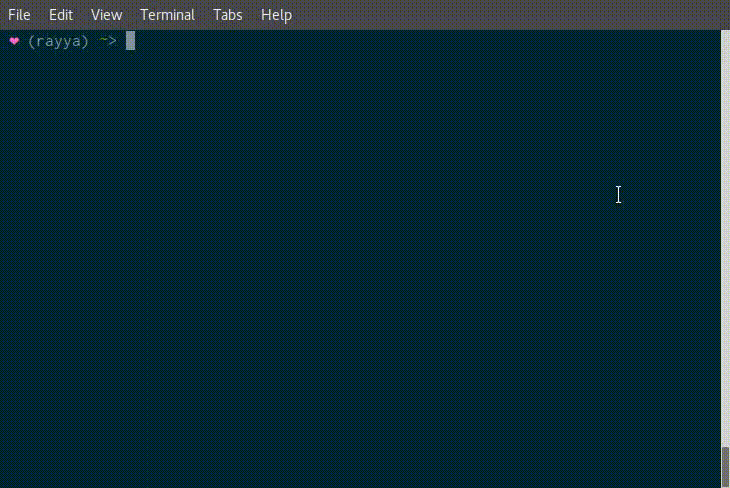

# fool

A powerful git commandline interface which is focused on usability. Use quick keyboard shortcuts to manage your repository, files and commits.

## How to use

`fool` is centered around keyboard shortcuts. Use the arrow-keys to move your cursor, then press a key to issue an action to the selected file. Some commands (committing, pushing, managing remotes, etc) will trigger the same action, no matter the selected file.

## How to install

`fool` is written in Rust and as such is a single, self-contained binary. You can get the sources and build it yourself via [cargo](https://doc.rust-lang.org/cargo/) or just download a pre-compiled binary [here](https://github.com/spacekookie/fool/releases)

There is a list of more packages available [in the wiki](https://github.com/spacekookie/fool/wiki/packaging)

## License

`fool` is free software: you can redistribute it and/or modify it under the terms of the MIT Public License.

This program is distributed in the hope that it will be useful, but WITHOUT ANY WARRANTY; without even the implied warranty of MERCHANTABILITY or FITNESS FOR A PARTICULAR PURPOSE. See the MIT Public License for more details.

## Conduct

In the interest of fostering an open and welcoming environment, the `fool` project pledges to making participation a harassment-free experience for everyone. See [Code of Conduct](CODE_OF_CONDUCT.md) for details. In case of violations, e-mail [kookie@spacekookie.de](mailto:kookie@spacekookie.de).

If Code of Conducts somehow upset you, please feel free to not use `fool`