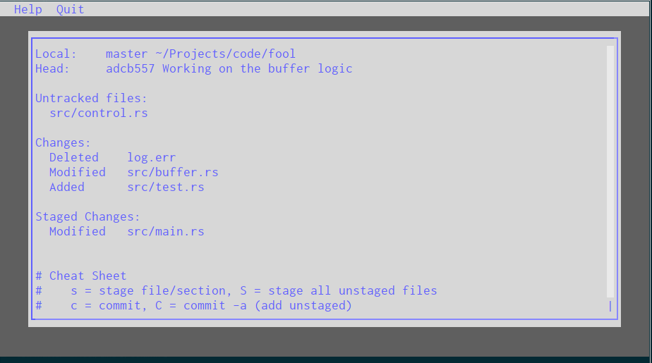

# fool

A powerful git commandline interface which is focused on usability. Use quick keyboard shortcuts to manage your repository, files and commits.

## How to install

`fool` is written in Rust and as such is a single, self-contained binary. You can get the sources and build it yourself via [cargo]() or just download a pre-compiled binary [here]()

## How to use

`fool` is centered around keyboard shortcuts. Use the arrow-keys to move your cursor, then press a key to issue an action to the selected file. Some commands (committing, pushing, managing remotes, etc) will trigger the same action, no matter the selected file.

